## 📘 SaaS Labs Hackathon Documentation

### Overview

The **SaaS Labs Hackathon** project is a multi-agent system designed to assist early-stage SaaS startups in crafting effective content strategies and financial models. It leverages AI agents for content generation, SEO optimization, ad creation, and financial analysis, providing a streamlined workflow for startup teams. This project was done during AI Intern Hackathon program arranged by Liberate Labs.

---

### 🧩 System Architecture

#### Agents

* **Content Agent**: Generates SEO-optimized landing pages, ad copies, email sequences, and blog strategies based on product positioning and target personas.

* **Finance and Pricing Agent**: Analyzes cost structures, competitor pricing, and target customer profiles to recommend monetization models. Calculates financial metrics such as ARPU, CAC, and LTV using uploaded datasets.

#### Workflow

The system utilizes LangGraph to manage the flow between agents. A checkpointer ensures state persistence across sessions.

---

### 🚀 Getting Started

#### Prerequisites

* Python 3.11

* Virtual environment setup (e.g., `venv`)

* API keys for OpenAI and Google Trends

#### Installation

```bash
git clone https://github.com/hasin-jawad/SaaS-Labs-Hackathon.git
cd SaaS-Labs-Hackathon
python -m venv venv
venv\Scripts\activate
pip install -r requirements.txt
```

#### Running the Application

```bash
uvicorn app.main:app --reload
```

The application will be accessible at `http://localhost:8000`.

---

### 🖥️ User Interface

A Streamlit-based UI is provided for ease of interaction.

#### Launching the UI

```bash
streamlit run app.py
```

This will open a browser window with two tabs:

* **📣 Content Agent**: Input product context and upload reference PDFs to generate content strategies.

* **💸 Pricing Agent**: Input pricing challenges and upload financial data (Excel files) to receive financial analyses.

---

### 📂 Project Structure

```
SaaS-Labs-Hackathon/
├── app/
│   ├── api/
│   ├── core/
│   ├── graphs/
│   ├── llm/
│   ├── prompts/
│   ├── schemas/
│   ├── pydantic/
├── faiss_index
├── output
├── uploads
├── main.py
├── app.py
├── requirements.txt
└── README.md
```

* `app/api/`: FastAPI endpoints for content and pricing agents.

* `app/core/`: Checkpointer.

* `app/graphs/`: LangGraph workflows for agent orchestration.

* `app/llm/`: Language model services and agent definitions.

* `app/prompts/`: Prompt templates for various agents.

* `app/schemas/`: Request and response schemas for FastAPI.
  
* `uploads/`: Dataset uploaded for analysis or PDF uploaded for RAG.

---

### 🔍 Features

#### Content Agent

* **Core Functionality**: Generates SEO-optimized landing pages, provides suggestions on ad copy, email sequences, and blog strategies based on product positioning and target personas.

* **User Benefits**: Helps founders instantly launch high-converting marketing assets without needing copywriters. Ensures message-market fit across channels.

#### Finance and Pricing Agent

* **Core Functionality**: Evaluates cost structures, competitor pricing, and target customer profiles to recommend monetization models. Calculates financial metrics such as ARPU, CAC, and LTV using uploaded datasets.

* **User Benefits**: Enables non-financial founders to simulate revenue models, test pricing strategies, and gain investor-grade financial clarity without a dedicated finance team.


---

### 📈 Workflow Diagram
#### 1. Content Workflow

```mermaid
graph TD
    A([Start: User Input]) --> B[Content Function<br>Extract: Persona, Position,<br>Target, Function]

    B --> C[Get SEO Keywords<br>via Google Trends]
    C --> D[Generate SEO Strategy<br>→ With Trend-Aware Keywords]
    D --> E1[END]

    B --> F[Generate Landing Page<br>→ Prompted Directly]
    F --> E2[END]

    B --> G[Generate Ad Copy<br>→ Prompted Directly]
    G --> E3[END]

    B --> H[END]
```

#### 2. Finance and Pricing Workflow


---

